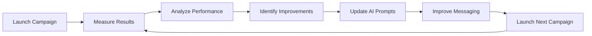

# 🚀 AI-Driven Cold Outreach Playbook for B2B SaaS


---

# Executive Summary

This playbook presents a practical framework for AI-assisted cold outreach in B2B SaaS, synthesized from research conducted across ten experienced practitioners in outbound sales, cold email, sales psychology, and go-to-market (GTM) execution. Rather than relying on a single methodology, this document compares multiple expert perspectives and extracts the practices that appear most consistent, evidence-based, and applicable to modern outbound teams.

The research draws on LinkedIn posts, YouTube content, and podcasts from practitioners including Alex Berman, Daniel Fazio, Will Allred, Josh Braun, Kevin Dorsey, Justin Welsh, Florin Tatulea, Tristan Pelligrino, Belal Batrawy, and Morgan J. Ingram. These experts were selected because they actively build, operate, or advise B2B SaaS sales organizations and consistently publish practical insights based on real-world execution rather than theory.

The objective of this playbook is not to summarize expert opinions. Instead, it evaluates where experts agree, where they disagree, which recommendations should be adopted, and which should be rejected. Every major recommendation is supported by the research collected in this repository and includes references to the original source wherever applicable. The playbook also documents my own reasoning, original ideas, and acknowledged limitations to demonstrate independent analysis rather than simply aggregating existing advice.

The intended audience includes founders, GTM teams, SDRs, account executives, and sales professionals seeking a repeatable outbound system that combines human judgment with AI-assisted workflows while maintaining personalization, relevance, ethical outreach, and long-term relationship building.

---

# Research Methodology

## Objective

The objective of this research was to develop an evidence-based cold outreach playbook for B2B SaaS by studying experienced practitioners who actively build, execute, or advise outbound sales systems. Instead of relying on a single expert or framework, I compared multiple viewpoints to identify recurring best practices, conflicting recommendations, and practical implementation strategies.

---

## Expert Selection Criteria

The experts included in this research were selected using the following criteria:

- Active practitioners with proven experience in B2B SaaS outbound sales or GTM execution
- Consistent publication of educational content through LinkedIn, YouTube, or podcasts
- Practical, experience-driven advice rather than purely theoretical concepts
- Coverage of one or more areas including cold email, prospecting, personalization, sales psychology, AI-assisted outreach, or deliverability

The final research set includes:

- Alex Berman
- Daniel Fazio
- Will Allred
- Josh Braun
- Kevin Dorsey
- Justin Welsh
- Florin Tatulea
- Tristan Pelligrino
- Belal Batrawy
- Morgan J. Ingram

---

## Data Collection Process

Research materials were collected from publicly available sources, including:

- LinkedIn posts
- YouTube videos and transcripts
- Podcast episodes (where available)

To maintain transparency and reproducibility, all collected materials were organized within this repository under dedicated research folders.

Repository structure:

```text
research/
├── linkedin-posts/
├── youtube-transcripts/
├── sources.md
└── other/
```

---

## Analysis Process

Instead of copying recommendations directly, every source was reviewed to identify:

- Repeated patterns across multiple experts
- Differences in strategy and execution
- Practical recommendations supported by real-world examples
- Assumptions, limitations, and potential trade-offs

When multiple experts recommended similar approaches, those ideas were treated as higher-confidence practices. When opinions differed, each perspective was evaluated before selecting the recommendation included in this playbook.

---

## Scope

This playbook focuses specifically on AI-assisted cold outreach for B2B SaaS companies.

It primarily covers:

- Ideal Customer Profile (ICP) selection
- Prospect research
- Personalization
- Cold email writing
- Follow-up strategy
- AI-assisted workflows
- Continuous optimization

Topics such as paid advertising, inbound marketing, pricing strategy, and CRM implementation are intentionally excluded because they fall outside the scope of this research.

---

## Research Limitations

The research is based on publicly available educational content rather than proprietary internal sales data. While the selected experts have significant practical experience, their recommendations may not be universally applicable across every industry, company size, or sales motion.

To address this limitation, recommendations in this playbook were synthesized across multiple experts instead of relying on any single individual's methodology.

---

# 📌 AI-Driven Cold Outreach SOP

## 3.1 Define the Ideal Customer Profile (ICP)

### 🎯 Objective

The success of any cold outreach campaign depends on targeting the right audience. Sending highly personalized emails to the wrong prospects is less effective than sending relevant messages to organizations that closely match the product's Ideal Customer Profile (ICP).

Rather than starting with email copy, the first step is identifying companies and decision-makers who are most likely to experience the problem your solution solves.

---

### Recommended ICP Criteria

Evaluate prospects using the following attributes:

- Industry (e.g., B2B SaaS, FinTech, HR Tech)
- Company size (Startup, Mid-Market, Enterprise)
- Employee count
- Revenue or growth stage
- Decision-maker role (Founder, CEO, VP Sales, Head of Growth)
- Geographic market
- Existing technology stack
- Recent business signals

---

### Buying Signals

Prioritize prospects demonstrating measurable buying intent, including:

- Recent funding announcements
- Active hiring for sales or growth roles
- Product launches
- Expansion into new markets
- Leadership changes
- Rapid employee growth

These signals often indicate that an organization is investing in growth and may be more receptive to outbound conversations.

---

### Best Practices

- Prioritize quality over quantity when building prospect lists.
- Segment prospects into clear ICP categories before writing outreach.
- Use recent business signals to improve message relevance.
- Revisit and refine the ICP regularly as new campaign data becomes available.

---

### Why This Approach

Multiple experts emphasize that poor targeting cannot be compensated for through better email copy. Personalization becomes significantly more effective when the underlying ICP is well defined and supported by current business signals.

---

### Sources

- Alex Berman – YouTube: https://www.youtube.com/@AlexBerman
- Kevin Dorsey – LinkedIn: https://www.linkedin.com/in/kddorsey3/
- Justin Welsh – LinkedIn: https://www.linkedin.com/in/justinwelsh/

---

## 3.2 Prospect Research

### 🎯 Objective

Effective cold outreach begins with understanding the prospect's business context before writing the first email. The objective of prospect research is to identify relevant signals that indicate potential business needs and create opportunities for meaningful, personalized conversations.

---

### Research Sources

Gather information from multiple trusted sources, including:

- LinkedIn profiles
- Company websites
- Careers or hiring pages
- Funding announcements
- Company blogs and product updates
- Press releases
- Industry news
- Technology stack databases (where applicable)

---

### High-Intent Buying Signals

Prioritize prospects that demonstrate one or more of the following:

- Recently raised funding
- Hiring SDRs, AEs, or Growth roles
- Product launches or feature releases
- Expansion into new markets
- Leadership or executive changes
- Rapid hiring or company growth
- Recent partnerships or acquisitions

These events often indicate that a company is actively investing in growth and may be more receptive to outbound outreach.

---

### AI-Assisted Research Workflow

AI can significantly reduce research time by:

- Summarizing company information
- Identifying recent growth signals
- Extracting relevant news
- Suggesting personalization opportunities
- Organizing research into structured prospect notes

Human review is still essential to verify AI-generated summaries before using them in outreach.

---

### Best Practices

- Spend more time researching high-value accounts.
- Verify information using multiple sources.
- Focus on facts rather than assumptions.
- Record research findings before drafting emails.
- Keep prospect notes concise and actionable.

---

### Why This Approach

Across multiple experts, successful cold outreach consistently begins with understanding the prospect rather than immediately writing an email. Companies experiencing visible business changes are more likely to have identifiable pain points and stronger reasons to engage in conversation.

---

### Sources

- Josh Braun – LinkedIn: https://www.linkedin.com/in/josh-braun/
- Justin Welsh – LinkedIn: https://www.linkedin.com/in/justinwelsh/
- Florin Tatulea – LinkedIn: https://www.linkedin.com/in/florintatulea/
- Morgan J. Ingram – LinkedIn: https://www.linkedin.com/in/morganjingramamp

---

## 3.3 Personalization Strategy

### 🎯 Objective

Personalization aims to demonstrate relevance—not simply prove that research was conducted. Effective personalization connects a prospect's current business context to a problem that your solution can address. The objective is to make the recipient feel that the message was written specifically for them without appearing forced or artificial.

---

### What to Personalize

Prioritize information that is directly relevant to the prospect's business, including:

- Recent funding announcements
- Hiring activity
- Product launches
- Company growth initiatives
- Leadership changes
- Public interviews or podcasts
- Customer success stories
- Technology stack changes

---

### What to Avoid

Avoid personalization that does not contribute to the conversation, such as:

- Generic compliments
- Mentioning hobbies unrelated to business
- Referencing old or outdated achievements
- Adding unnecessary details simply to appear personalized

Personalization should always support the business conversation rather than distract from it.

---

### AI-Assisted Personalization

AI can accelerate personalization by:

- Summarizing recent company news
- Identifying business signals
- Suggesting opening lines
- Drafting multiple email variations
- Highlighting potential pain points

However, every AI-generated message should be reviewed before sending to ensure factual accuracy, relevance, and natural language.

---

### Best Practices

- Personalize the opening paragraph using recent business context.
- Keep personalization concise and relevant.
- Focus on solving business problems instead of promoting features.
- Use AI to accelerate research, but rely on human judgment for the final message.
- Match the tone of the message to the recipient and company culture.

---

### Why This Approach

Research across multiple experts suggests that effective personalization is not about writing longer emails—it is about increasing relevance. Buyers respond more positively when outreach demonstrates an understanding of their business challenges instead of relying on generic templates or excessive flattery.

---

### Sources

- Josh Braun – LinkedIn: https://www.linkedin.com/in/josh-braun/
- Will Allred – LinkedIn: https://www.linkedin.com/in/williamallred/
- Belal Batrawy – LinkedIn: https://www.linkedin.com/in/belbatrawy/
- Alex Berman – YouTube: https://www.youtube.com/@AlexBerman

---

## 3.4 Cold Email Structure

### 🎯 Objective

The objective of a cold email is not to immediately sell a product or schedule a meeting. Instead, it should initiate a relevant business conversation by demonstrating an understanding of the prospect's context and presenting a clear reason to continue the discussion.

Successful cold emails are concise, personalized, and focused on the recipient rather than the sender.

---

### Recommended Email Framework

A high-performing cold email should include the following elements:

#### 1. Subject Line

Keep subject lines short, natural, and curiosity-driven.

Examples:

- Quick question
- Thought about {{Company}}
- Idea for your sales team

Avoid:

- Clickbait
- Excessive capitalization
- Promotional language
- Misleading subject lines

---

#### 2. Personalized Opening

Start with a relevant observation about the company or decision-maker.

Examples include:

- Recent funding
- Hiring activity
- Product launch
- Company growth
- Leadership announcement

The opening should demonstrate genuine research instead of generic compliments.

---

#### 3. Business Context

Briefly explain why the prospect was selected.

Focus on:

- Current business challenges
- Growth initiatives
- Operational pain points

Avoid discussing your company too early.

---

#### 4. Value Proposition

Clearly explain:

- the problem you solve
- who you help
- why it matters

Keep this section outcome-focused instead of feature-focused.

---

#### 5. Call-to-Action (CTA)

Use a low-friction CTA that encourages conversation rather than commitment.

Examples:

- Would it make sense to explore this?
- Open to a quick conversation?
- Worth discussing further?

Avoid aggressive meeting requests or lengthy scheduling instructions in the first email.

---

### Recommended Email Characteristics

- 50–120 words
- One primary idea
- One CTA
- Simple language
- Mobile-friendly formatting
- No unnecessary jargon

---

### Common Mistakes

Avoid:

- Talking mostly about your company
- Long paragraphs
- Multiple CTAs
- Generic templates
- Over-personalization
- Excessive feature lists
- Hard-selling in the first email

---

### AI-Assisted Drafting

AI can assist by:

- Generating subject line variations
- Drafting multiple email versions
- Simplifying complex language
- Improving readability
- Suggesting personalization opportunities

Every AI-generated email should be reviewed to ensure accuracy, relevance, and a natural conversational tone.

---

### Why This Approach

Across multiple experts, successful cold emails consistently prioritize relevance over length and clarity over complexity. Personalized business context combined with a simple, conversational CTA is more effective than lengthy product-focused messaging.

---

### Sources

- Alex Berman – YouTube: https://www.youtube.com/@AlexBerman
- Daniel Fazio – LinkedIn: https://www.linkedin.com/in/coldemailwizard/
- Josh Braun – LinkedIn: https://www.linkedin.com/in/josh-braun/
- Will Allred – LinkedIn: https://www.linkedin.com/in/williamallred/

---

## 3.5 Example Cold Email

The following example applies the principles described throughout this playbook, including ICP targeting, signal-based personalization, concise messaging, and a low-friction call-to-action.

---

### Example

**Subject:** Quick question about your outbound strategy

Hi {{First Name}},

I noticed your team has been expanding its sales organization and recently opened several new outbound roles.

That usually signals a strong focus on pipeline growth, so I wanted to reach out.

Many B2B SaaS teams at this stage struggle to maintain reply rates while scaling outbound efforts.

We've helped similar companies improve personalization and increase positive responses without dramatically increasing manual work.

Would you be open to a brief conversation next week to see if any of these ideas are relevant for your team?

Best,

{{Your Name}}

---

### Why This Email Works

This email intentionally follows several principles identified throughout the research:

- Opens with a relevant business signal instead of a generic compliment.
- Focuses on the prospect's business before mentioning the solution.
- Uses concise language that is easy to read on mobile devices.
- Avoids unnecessary product descriptions.
- Ends with a low-friction CTA that encourages conversation rather than forcing a meeting.

---

### Best Practices

- Keep emails under approximately 120 words.
- Personalize only information that improves relevance.
- Write conversationally instead of using marketing language.
- Include only one clear CTA.
- Review AI-generated drafts before sending.

---

### Sources

- Alex Berman – YouTube: https://www.youtube.com/@AlexBerman
- Josh Braun – LinkedIn: https://www.linkedin.com/in/josh-braun/
- Daniel Fazio – LinkedIn: https://www.linkedin.com/in/coldemailwizard/
- Will Allred – LinkedIn: https://www.linkedin.com/in/williamallred/

---

## 3.6 Follow-up Strategy

### 🎯 Objective

Most positive replies occur after the initial email rather than from the first touchpoint. A structured follow-up sequence helps maintain visibility, reinforces value, and increases the likelihood of starting a conversation without becoming intrusive.

---

### Recommended Follow-up Sequence

| Touchpoint | Timing | Goal |
|------------|---------|------|
| Email 1 | Day 0 | Introduce yourself and establish relevance |
| Follow-up 1 | Day 2–3 | Reinforce the original value proposition |
| Follow-up 2 | Day 5–7 | Introduce a new insight, case study, or business observation |
| Follow-up 3 | Day 10–14 | Send a concise "break-up" email or ask whether outreach should continue |

---

### Best Practices

- Space follow-ups appropriately instead of sending emails daily.
- Introduce new information or value in every follow-up.
- Reference previous messages naturally.
- Maintain a conversational tone.
- Stop outreach after a reasonable number of attempts.

---

### What to Avoid

Avoid:

- Sending identical follow-up messages
- Asking "Just following up..." without adding value
- Increasing pressure with every email
- Sending long emails
- Continuing outreach indefinitely after repeated non-response

---

### AI-Assisted Follow-ups

AI can help by:

- Generating multiple follow-up variations
- Suggesting additional personalization
- Summarizing previous conversations
- Rewriting messages to improve clarity
- Adapting tone for different buyer personas

All AI-generated follow-ups should be reviewed before sending to ensure accuracy and relevance.

---

### Why This Approach

The research consistently suggests that follow-ups should contribute additional value rather than simply remind the prospect that an earlier email was sent. Each touchpoint should provide a new reason to continue the conversation while respecting the recipient's time.

---

### Sources

- Daniel Fazio – LinkedIn: https://www.linkedin.com/in/coldemailwizard/
- Alex Berman – YouTube: https://www.youtube.com/@AlexBerman
- Morgan J. Ingram – LinkedIn: https://www.linkedin.com/in/morganjingramamp
- Josh Braun – LinkedIn: https://www.linkedin.com/in/josh-braun/

---

## 3.7 AI-Assisted Outreach Workflow

### 🎯 Objective

Artificial Intelligence should augment—not replace—the outbound sales process. The objective is to automate repetitive research and drafting tasks while preserving human judgment for strategic decisions, relationship building, and final message approval.

---

## Recommended AI Workflow

```text
Prospect List
      │
      ▼
AI Research
(Company Summary + Buying Signals)
      │
      ▼
Human Verification
(Check Accuracy)
      │
      ▼
AI Personalization
(Opening Line + Pain Points)
      │
      ▼
Human Review
(Edit Tone & Relevance)
      │
      ▼
AI Email Draft
(Multiple Variations)
      │
      ▼
Final Human Approval
      │
      ▼
Send Campaign
      │
      ▼
Track Results
      │
      ▼
AI Performance Analysis
      │
      ▼
Continuous Improvement
```

---

### Recommended AI Applications

AI can assist with:

- Company research
- Prospect summarization
- Buying signal detection
- Email drafting
- Subject line generation
- Personalization suggestions
- Follow-up generation
- Performance analysis
- A/B testing ideas

---

### Human Responsibilities

Human review remains essential for:

- ICP selection
- Strategic account prioritization
- Validating AI-generated research
- Checking factual accuracy
- Ensuring personalization is relevant
- Final approval before sending
- Relationship building after replies

---

### Guiding Principles

- Use AI to save time—not to eliminate thinking.
- Verify every important business fact before outreach.
- Personalization should always be meaningful rather than automated for its own sake.
- AI-generated content should sound natural and conversational.
- Measure campaign performance continuously and refine prompts based on results.

---

### Why This Approach

The research suggests that AI is most effective when used as a productivity tool instead of an autonomous sales representative. Experts consistently emphasize that successful outreach depends on understanding business context, building trust, and communicating naturally—areas where human judgment remains essential.

---

### Sources

- Will Allred – LinkedIn: https://www.linkedin.com/in/williamallred/
- Daniel Fazio – LinkedIn: https://www.linkedin.com/in/coldemailwizard/
- Kevin Dorsey – LinkedIn: https://www.linkedin.com/in/kddorsey3/
- Justin Welsh – LinkedIn: https://www.linkedin.com/in/justinwelsh/

---

## 3.8 Optimization & Performance Measurement

### 🎯 Objective

Cold outreach should be treated as a continuous improvement process rather than a one-time campaign. Measuring performance and iterating based on data enables teams to refine messaging, targeting, and personalization while improving conversion rates over time.

---

### Key Performance Indicators (KPIs)

Track the following metrics for every campaign:

| KPI | Why It Matters |
|------|----------------|
| Delivery Rate | Indicates email deliverability and domain health |
| Open Rate | Measures subject line effectiveness |
| Reply Rate | Indicates message relevance |
| Positive Reply Rate | Measures qualified engagement |
| Meeting Booking Rate | Evaluates CTA effectiveness |
| Opportunity Conversion | Measures sales impact |
| Response Time | Helps optimize follow-up timing |

---

### Weekly Optimization Process

1. Review campaign performance.
2. Identify the highest-performing emails.
3. Compare successful and unsuccessful campaigns.
4. Update messaging based on observed patterns.
5. Refine ICP segmentation.
6. Improve AI prompts using campaign insights.
7. Launch the next iteration.

---

### Recommended A/B Tests

Test only one variable at a time.

Possible experiments include:

- Subject lines
- Opening sentences
- Personalization depth
- Call-to-action wording
- Email length
- Follow-up timing
- Prospect segmentation

Document every experiment and its outcome before implementing changes across future campaigns.

---

### AI-Assisted Performance Analysis

AI can help identify:

- High-performing email patterns
- Common reply themes
- Frequently occurring objections
- Best-performing CTAs
- Subject line trends
- Follow-up effectiveness

Human review should validate AI-generated insights before making strategic decisions.

---

### Continuous Improvement Cycle



---

### Why This Approach

The experts consistently emphasize that successful outbound systems improve through experimentation rather than assumptions. Campaign metrics should guide future decisions instead of relying on intuition alone. AI can accelerate analysis, but meaningful optimization requires human interpretation and continuous testing.

---

### Sources

- Will Allred – LinkedIn: https://www.linkedin.com/in/williamallred/
- Kevin Dorsey – LinkedIn: https://www.linkedin.com/in/kddorsey3/
- Daniel Fazio – LinkedIn: https://www.linkedin.com/in/coldemailwizard/
- Morgan J. Ingram – LinkedIn: https://www.linkedin.com/in/morganjingramamp/

---

# Where Experts Disagree

One of the key observations from this research is that experienced practitioners often agree on the overall objective of effective cold outreach but differ significantly in execution. Rather than selecting one methodology uncritically, I compared opposing viewpoints and evaluated which approach is most appropriate for modern B2B SaaS outbound.

---

## 4.1 Personalization: Deep Research vs Scalable Relevance

### Expert A: Josh Braun

Josh Braun advocates for meaningful, human-centered personalization. His approach emphasizes understanding the prospect's business situation and writing messages that create genuine conversations rather than relying on sales tactics.

**Source:**
- LinkedIn Post: (add your collected post URL)
- Profile: https://www.linkedin.com/in/josh-braun/

---

### Expert B: Alex Berman

Alex Berman argues that personalization should remain efficient and scalable. Rather than spending excessive time researching every prospect, he recommends using repeatable personalization patterns that can be applied across qualified prospect lists.

**Source:**
- YouTube: https://www.youtube.com/@AlexBerman
- Transcript: (your repository link)

---

### My Position

I agree more closely with **Josh Braun's philosophy**, but with practical modifications.

Deep personalization improves response quality for high-value accounts, while lightweight personalization supported by AI is more appropriate for larger prospect lists.

Therefore, I recommend:

- Enterprise accounts → deeper manual research.
- SMB campaigns → AI-assisted personalization with human review.

This hybrid approach balances quality with scalability.

---

## 4.2 Email Length: Short vs Detailed

### Expert A: Daniel Fazio

Daniel Fazio recommends concise emails that quickly communicate value and encourage replies without overwhelming the recipient.

**Source:**
- LinkedIn Post: (add URL)

---

### Expert B: Justin Welsh

Justin Welsh occasionally advocates providing slightly more context and educational value before requesting a conversation, particularly when targeting founders or executives.

**Source:**
- LinkedIn Post: (add URL)

---

### My Position

I favor **Daniel Fazio's approach**.

Decision-makers receive large volumes of outbound messages. Short, relevant emails reduce cognitive load while making it easier for recipients to identify the purpose of the outreach.

However, additional context can be appropriate when the solution requires more explanation or targets highly technical audiences.

---

## 4.3 AI Automation: Maximum Automation vs Human Oversight

### Expert A: Daniel Fazio

Daniel Fazio frequently demonstrates AI-assisted workflows that automate research, drafting, and campaign execution to improve productivity.

**Source:**
- LinkedIn / YouTube

---

### Expert B: Will Allred

Will Allred emphasizes that AI should improve writing quality but not replace human judgment. Messages should remain conversational and authentic.

**Source:**
- LinkedIn

---

### My Position

I believe AI should function as a productivity assistant rather than an autonomous SDR.

AI is highly effective for:

- research
- summarization
- drafting
- generating variations

Human review remains essential for:

- strategic decisions
- personalization
- fact verification
- relationship building

This balance maximizes efficiency while reducing the risks of inaccurate or generic outreach.

---

# What I Rejected and Why

Not every recommendation from the researched experts was included in this playbook. The following ideas were intentionally excluded after evaluating their applicability, scalability, and long-term effectiveness for modern B2B SaaS outbound.

---

## 5.1 Excessive Personalization for Every Prospect

### Recommendation

Some practitioners advocate spending significant time researching every individual prospect before sending the first email.

### Why I Rejected It

While deep personalization can improve response quality for strategic enterprise accounts, it is not practical for high-volume outbound campaigns.

For most B2B SaaS teams, a hybrid approach is more sustainable:

- Deep research for high-value accounts
- AI-assisted personalization for larger prospect lists
- Human review before sending

This balances personalization quality with operational efficiency.

**Related Experts:**
- Josh Braun
- Alex Berman

---

## 5.2 Fully AI-Generated Outreach Without Human Review

### Recommendation

Some AI-focused workflows encourage generating complete outbound campaigns with minimal human involvement.

### Why I Rejected It

Although AI significantly improves productivity, relying entirely on AI introduces several risks:

- Hallucinated business information
- Generic messaging
- Incorrect personalization
- Loss of authentic communication
- Reduced trust with prospects

I believe AI should function as a productivity assistant rather than an autonomous SDR.

Every outbound message should receive human review before delivery.

**Related Experts:**
- Daniel Fazio
- Will Allred

---

## Conclusion

The objective of this playbook is not to maximize automation or personalization independently, but to create an outbound system that is scalable, evidence-based, and sustainable.

Whenever expert recommendations conflicted with practical implementation, I prioritized approaches that balanced efficiency, personalization, accuracy, and long-term relationship building.

---

# My Original Ideas

The following ideas were developed after reviewing the research collected for this repository. They are not direct recommendations from any single expert but are original proposals intended to improve AI-assisted cold outreach by combining the strengths of multiple approaches.

---

## 6.1 Dynamic Personalization Depth

### Idea

Instead of applying the same level of personalization to every prospect, outreach should adjust its personalization depth based on the potential value of the account.

For example:

| Account Type | Personalization Strategy |
|--------------|--------------------------|
| Enterprise | Deep manual research + AI assistance |
| Mid-Market | AI-generated research with human refinement |
| SMB | AI-assisted personalization with standardized templates |

---

### Why It Could Work

Most experts discuss personalization, but they generally treat it as a single process.

I believe personalization should be proportional to account value. Investing thirty minutes researching every prospect is difficult to scale, while sending generic emails reduces response quality.

Adjusting personalization depth according to account value creates a balance between efficiency and effectiveness.

---

## 6.2 AI Confidence Check Before Sending

### Idea

Before any AI-generated email is sent, introduce a "Confidence Check" step where AI evaluates the draft against a predefined checklist.

Example questions:

- Is the personalization based on a verifiable business fact?
- Does the email mention only one primary value proposition?
- Is the CTA conversational rather than aggressive?
- Are there unsupported assumptions?
- Is the email under the target word count?

Emails failing these checks should be reviewed before sending.

---

### Why It Could Work

Current AI workflows focus heavily on generating emails but spend less attention on validating output quality.

Adding an automated quality-control stage can reduce factual errors, improve consistency, and increase trust in AI-assisted outbound campaigns.

---

## 6.3 Outreach Learning Repository

### Idea

Instead of storing only successful templates, maintain an internal repository documenting:

- Winning subject lines
- Successful personalization examples
- Common objections
- Failed email experiments
- AI prompts that consistently perform well

This repository should evolve continuously based on campaign results.

---

### Why It Could Work

Most outbound teams learn from experience, but that knowledge often remains undocumented.

A centralized knowledge base enables continuous improvement, faster onboarding, and more consistent campaign performance over time.

---

## Conclusion

These ideas extend the research presented in this playbook rather than replacing it. They are intended to encourage experimentation while maintaining the evidence-based principles identified throughout the research process.

---

# Weaknesses of this Playbook

No playbook is universally applicable. While this document synthesizes insights from experienced practitioners and incorporates independent analysis, several limitations should be acknowledged.

---

## 7.1 Based on Publicly Available Content

The recommendations in this playbook are derived from publicly available LinkedIn posts, YouTube videos, podcasts, and educational content rather than proprietary sales data or internal company playbooks.

As a result, some recommendations may simplify challenges that are more complex in real-world enterprise sales environments.

---

## 7.2 Limited Industry Scope

This playbook focuses specifically on **B2B SaaS outbound sales**.

The recommended strategies may require significant adaptation for:

- E-commerce
- Healthcare
- Government
- Manufacturing
- Consumer products
- Non-profit organizations

Each industry has different buying cycles, compliance requirements, and customer expectations.

---

## 7.3 AI Output Requires Human Verification

Although AI significantly accelerates research and drafting, it may produce:

- Incorrect business information
- Outdated company details
- Hallucinated facts
- Generic messaging

Every AI-generated output should therefore be reviewed before being used in customer communication.

---

## 7.4 Recommendations May Become Outdated

Outbound sales evolves rapidly.

Email deliverability practices, buyer behavior, AI capabilities, and platform algorithms continue to change.

Some recommendations in this playbook may require periodic review as new technologies and best practices emerge.

---

## 7.5 No Large-Scale Experimental Validation

The workflow proposed in this playbook has been synthesized from expert research rather than validated through a controlled experiment across thousands of outbound campaigns.

While the recommendations are supported by experienced practitioners, individual organizations should validate them through A/B testing and continuous measurement.

---

## 7.6 Expert Bias

Each expert has developed recommendations based on their own experience, target audience, products, and sales environments.

Consequently, some advice may reflect individual preferences rather than universally applicable best practices.

This playbook attempts to reduce that bias by comparing multiple perspectives instead of relying on a single source.

---

## Conclusion

This playbook should be viewed as a structured starting point rather than a definitive guide. Continuous experimentation, measurement, and adaptation are essential for achieving long-term success in cold outreach.

---

# Who I Would NOT Recommend Following

Every expert included in this research provides valuable insights based on their own experience. However, not every expert's advice is equally applicable to building a practical, repeatable AI-assisted cold outreach playbook for B2B SaaS.

Rather than evaluating the quality of the individuals themselves, this section evaluates the suitability of their publicly shared content for the objectives of this playbook.

---

## Belal Batrawy

### Why I Would Not Recommend Him as a Primary Resource

Belal Batrawy's content focuses heavily on customer experience, messaging, and buyer empathy. While these perspectives are valuable for improving communication, they provide comparatively less step-by-step operational guidance for building scalable outbound systems.

For practitioners specifically seeking structured cold outreach processes, topics such as deliverability, prospecting workflows, campaign optimization, and AI-assisted execution receive less emphasis.

### Where His Content Is Still Valuable

I would still recommend following Belal for:

- Customer-centric messaging
- Communication quality
- Buyer empathy
- Long-term relationship building

These concepts complement outbound execution but are not sufficient as a standalone framework for building an AI-driven outreach system.

---

## Tristan Pelligrino

### Why I Would Not Recommend Him as a Primary Resource

Tristan Pelligrino provides thoughtful insights into email marketing and B2B communication. However, much of his content focuses on broader marketing strategy rather than end-to-end outbound sales execution.

Compared with experts such as Alex Berman, Daniel Fazio, Kevin Dorsey, or Josh Braun, there is less emphasis on scalable prospecting systems, cold email experimentation, deliverability, and AI-assisted outbound workflows.

### Where His Content Is Still Valuable

His content remains useful for:

- Email communication
- B2B messaging
- Content strategy
- Marketing perspective

However, I would use his advice as a complementary resource rather than a primary guide for outbound sales.

---

## Conclusion

The decision not to recommend these experts as primary resources does not reflect the quality of their work. Instead, it reflects the specific objective of this research: developing an evidence-based, AI-assisted cold outreach playbook for B2B SaaS.

For that purpose, I found the content from Alex Berman, Daniel Fazio, Josh Braun, Kevin Dorsey, Will Allred, Justin Welsh, and Morgan J. Ingram to provide more directly applicable frameworks for prospecting, personalization, outreach execution, and campaign optimization.

---

# References

The recommendations in this playbook are based on publicly available educational content from experienced B2B SaaS practitioners. Research materials include LinkedIn posts, YouTube videos, podcasts, and transcripts collected during the research phase of this project.

| Expert | Primary Topics | Research Sources |
|---------|----------------|------------------|
| Alex Berman | Cold Email, Lead Generation | YouTube, LinkedIn |
| Daniel Fazio | Cold Email Systems, Deliverability | YouTube, LinkedIn |
| Will Allred | Email Optimization, Sales Analytics | LinkedIn, Podcast |
| Josh Braun | Sales Psychology, Messaging | LinkedIn |
| Kevin Dorsey | Outbound Systems, SaaS Sales | LinkedIn, YouTube |
| Justin Welsh | GTM Strategy, Outbound Growth | LinkedIn |
| Florin Tatulea | SaaS Growth, Prospecting | LinkedIn |
| Tristan Pelligrino | Email Marketing, B2B Communication | LinkedIn, Podcast |
| Belal Batrawy | Customer Messaging, Buyer Experience | LinkedIn |
| Morgan J. Ingram | Social Selling, Modern Prospecting | LinkedIn, YouTube |

---

## Repository References

The supporting research is organized as follows:

```text
research/
├── sources.md
├── linkedin-posts/
├── youtube-transcripts/
└── other/
    ├── script.py
    ├── api-method.md
    └── supporting materials
```

---

## Citation Format

Throughout this playbook, recommendations reference their supporting source using the following format:

> **Source:** Expert Name, Platform, Original Link

Example:

> **Source:** Josh Braun, LinkedIn,
> https://www.linkedin.com/posts/josh-braun/...

This citation style ensures that every recommendation can be traced back to its original source for verification.

---

## Research Summary

- **Experts Researched:** 10
- **LinkedIn Posts Collected:** 16
- **YouTube Transcripts Collected:** 4
- **Platforms Covered:** LinkedIn, YouTube, Podcasts
- **Research Period:** August 2026

---

## Acknowledgements

This playbook synthesizes publicly available educational content from experienced practitioners while incorporating my own analysis, comparisons, and original recommendations. All external ideas remain attributed to their respective authors, and any conclusions or original frameworks presented in this document are my own.

